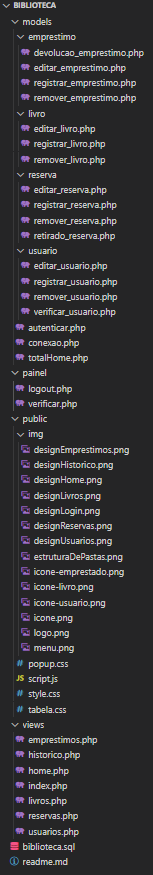

**Feito por MIGUEL SILVA TEIXEIRA**

# Sistema Gerenciador de Biblioteca

O Sistema foi feito utilizando multiplas páginas, ele tem uma interface gráfica amigável e intuitiva para o usuário, permite a consulta do acervo de livros disponíveis na biblioteca, realização  de reservas de livros, empréstimos de livros e registro de devoluções, permite a inclusão de novos livros no acervo e a atualização dos dados de livros já cadastrados, o sistema registra o histórico de empréstimos e devoluções de livros por usuário.  
Obs: Esse projeto é para a utilização da administração da biblioteca.

## **1. INSTRUÇÕES PARA RODAR O SISTEMA**
1) Baixe o Xampp - Start o module Apache
2) Baixe a pasta contendo o projeto e coloque no diretório C:\xampp\htdocs\
3) Baixe o MySQL Workbench. A configuração para conexão com o banco utilizada foi:
    $servername = "localhost";
    $username = "root";
    $password = "123456";
    $banco = "biblioteca";

   Obs: Caso utilize outra, vá no arquivo conexão e faça as alterações necessárias para conectar-se ao banco de dados.

4) Crie o banco biblioteca com o arquivo sql fornecido (biblioteca.sql)
5) No seu navegador digite para abrir o Sistema: <http://localhost/biblioteca/views/>
6) Você será redirecionado para a tela de login. Use as credenciais email: ‘<miguel.admin@gmail.com>’ e senha: ‘admin1’ para fazer o login.
7) Após o login você será redirecionado para a página HOME
8) Você pode se localizar utilizando o menu de navegação

## **2. ESTRUTURA DE PASTAS **

------------------------------
## **3. DESIGN**
// Tela de login (index.php) 

// Home (home.php) 

// Livros (livros.php) 

// Empréstimos (emprestimos.php) 

// Reservas (reservas.php) 

// Usuarios (usuarios.php) 

// Histórico (historico.php) 